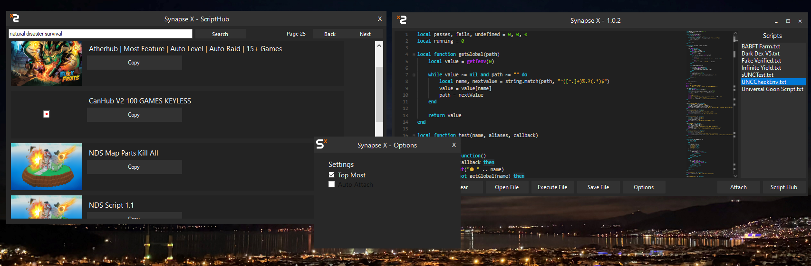
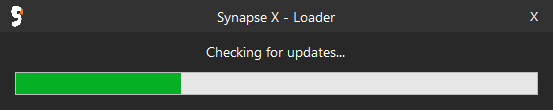
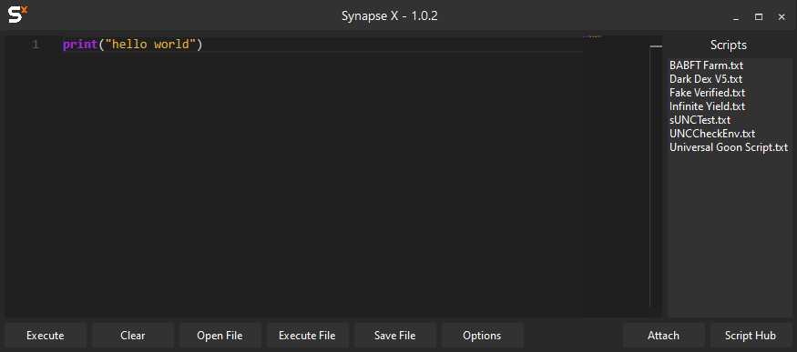

# synapse x ui remake by gigzaz (@segcent)
## this source is almost **2 years old**, and was modified recently to work with **Scamnapsia**
* pls star this repo

### Scamnapsia is an injector for roblox revivals for e.g. watrbx, korona. [>their discord<](https://discord.gg/WTWsRyybZf)

- coded in C# WinForms .NET
- could also check for updates from a direct link file
- this still has SXRE functions for injecting etc.
- this also has a scripthub that uses https://scriptblox.com API.
- credit me if you will use this.
#### ty for using this

  

  
  

